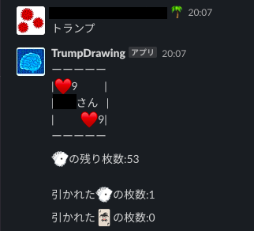
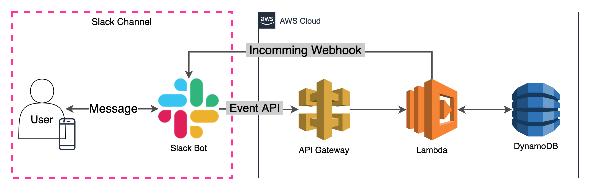

# SlackTrump

## Description

This application allows you to draw playing cards from slack.
You can enjoy drawing cards to avoid "3 Mitu".

### system configuration

## How to use

You need to set up the following

- Slack app
- DynamoDB
- Lambda function

If you post a post containing `トランプ` in a specified channel, you can draw a Trump

You can check the number of cards remaining, the number of cards drawn, and the number of jokers drawn.

More details will be provided in the future...
